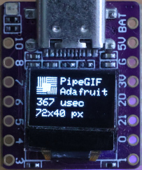
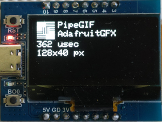
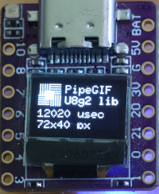
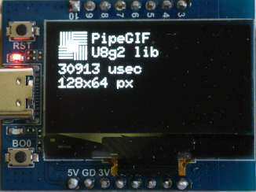

# PipeGIF

A streaming GIF decoder for Arduino and Linux. Feed it one byte at a time — no file seeking, no full image buffering.

```
GIF data → PipeGIF → LzwDecode → VirtualDisplay → your hardware
```

PipeGIF is built as a Finite State Machine (FSM). You push bytes in from any source — a `const` array, a file, an SD card, a network socket — and the decoder calls your `VirtualDisplay` methods as it makes progress. You never need to buffer the whole GIF. PipeGIF does not call any I/O as this will be handled in `VirtualDisplay` and thus no I/O-errors.

Adafruit_GFX library OLED demo with ESP32-C.

 


U8g2 library OLED demo with ESP32-C.

 


## Table of Contents

- [Features](#features)
- [Requirements](#requirements)
- [Quick Start](#quick-start)
- [VirtualDisplay — Writing Your Own Display Driver](#virtualdisplay----writing-your-own-display-driver)
- [PipeGIF API](#pipegif-api)
- [Error Codes](#error-codes)
- [Examples](#examples)
- [License](#license)

## Features

- GIF87a and GIF89a
- Animated GIF (multiple frames)
- Interlaced images
- Transparent color
- Any data source (const, file, SD card, network, …)
- Any display (OLED, TFT, serial terminal, framebuffer, …)
- Only ~20 KB RAM needed (GIF header + LZW tables)
- Little-endian MCU or CPU required

## Requirements

- C++11 or later
- GCC or Clang (struct bit-field packing must work correctly)
- Little-endian architecture (e.g. ESP32, most x86/x64, ARM Cortex)
- ~20 KB free RAM

Tested on ESP32-C3 with OLED 0.42" 72×40 and OLED 1.3" 128×64 displays.

---

## Quick Start

Three steps to get a GIF on your display:

**1. Subclass `VirtualDisplay` and implement at least `putPixel()`**

```cpp
#include "VirtualDisplay.h"

class MyDisplay : public VirtualDisplay {
public:
    void putPixel(uint8_t colorIndex) override {
        // draw one pixel at position (x, y) using colorIndex
        // x and y are maintained for you in the base class
    }
};
```

**2. Create a `PipeGIF` with your display**

```cpp
#include "PipeGIF.h"

MyDisplay myDisplay;
PipeGIF gif(&myDisplay);
```

**3. Feed bytes in one at a time**

```cpp
for (size_t i = 0; i < gifDataLength; i++) {
    int result = gif.decode(gifData[i]);
    if (result == GIF_TRAILER)
        break; // end of GIF
    if (result < 0) {
        // handle error
    }
}
```

---

## VirtualDisplay — Writing Your Own Display Driver

`VirtualDisplay` is an abstract base class. PipeGIF calls its methods as it decodes; your job is to subclass it and forward those calls to your hardware or output.

Only `putPixel()` is strictly required. All other methods have a default no-op implementation in the base class, so you can add them gradually as you need more features.

### The pixel coordinate system

The base class tracks the current pixel position in `x` and `y` (public members). You do not need to manage these yourself — `incrementX()` advances them including interlace handling. Just read `x` and `y` inside `putPixel()`.

### Method reference

| Method | Called when | Required? | What to do |
|---|---|---|---|
| `putPixel(colorIndex)` | Every decoded pixel | **Yes** | Draw one pixel at `(x, y)` using the given color index |
| `setCanvas(width, height)` | GIF Logical Screen Descriptor parsed | No | Allocate a framebuffer or configure your display size |
| `setImageLimits(width, height)` | Each image descriptor parsed | No | Set the size of the current frame |
| `setOffset(left, top)` | Each image descriptor parsed | No | Position the image within the canvas (for sub-images) |
| `setColorTableEntries(rows)` | Before color table data arrives | No | Prepare your color table storage |
| `setColorTable(intensity)` | Once per color table entry (R, G, B) | No | Store one intensity byte; called 3× per color |
| `setTransparentColor(index)` | Graphic Control Extension parsed | No | Remember which color index is transparent |
| `setInterlace(interlaced)` | Each image descriptor parsed | No | Note whether this frame is interlaced |
| `clearScreen()` | Start of each new frame | No | Clear display or framebuffer for animation |
| `imageEnded()` | End of each frame's pixel data | No | Flush buffer, trigger display refresh, etc. |
| `gotoXY()` | Internal use | No | Override only if you need custom cursor logic |

### Minimal example (ASCII art / serial output)

```cpp
class TtyDisplay : public VirtualDisplay {
public:
    void putPixel(uint8_t colorIndex) override {
        Serial.write( (colorIndex % 10) + '0' );
        if (0 == incrementX())
            Serial.println();
    }
};
```

### Color display example

```cpp
class ColorOledDisplay : public VirtualDisplay {
    uint8_t colorTable[256][3]; // R, G, B per index
    uint8_t colorChannel = 0;
    uint16_t colorRow = 0;

public:
    void setColorTableEntries(uint16_t rows) override {
        // If colorTable is not declared static it should be malloc'ed here.
        // uint8_t *colorTable = malloc( rows * 3 );
        colorRow = 0;
        colorChannel = 0;
    }

    void setColorTable(uint8_t intensity) override {
        colorTable[colorRow][colorChannel++] = intensity;
        if (colorChannel == 3) {
            colorChannel = 0;
            colorRow++;
        }
    }

    void putPixel(uint8_t colorIndex) override {
        if (colorIndex == transparantColor) return; // skip transparent
        uint8_t r = colorTable[colorIndex][0];
        uint8_t g = colorTable[colorIndex][1];
        uint8_t b = colorTable[colorIndex][2];
        myHardware.drawPixel(x, y, r, g, b);
    }

    void clearScreen() override {
        myHardware.fillScreen(0);
    }

    void imageEnded() override {
        myHardware.display(); // flush to screen
    }
};
```

---

## PipeGIF API

### `PipeGIF(VirtualDisplay *display)`

Constructor. Pass a pointer to your `VirtualDisplay` subclass.

### `int decode(uint8_t byte)`

Feed one byte of GIF data. Call this in a loop for every byte of your GIF.

Returns:
- `GIF_OK` (0) — byte consumed, keep going
- `GIF_TRAILER` (1) — end of GIF reached
- `GIF_DELAY100` (2) — a frame delay was encountered; call `getDelay100()` to get the value, then pause before feeding more bytes
- Negative value — an error occurred (see error codes below)

### `uint16_t getDelay100()`

Returns the delay time for the current frame in units of 1/100 second.
Call this when `decode()` returns `GIF_DELAY100`.

```cpp
if (result == GIF_DELAY100) {
    uint16_t delayMs = gif.getDelay100() * 10;
    delay(delayMs);
}
```

### `uint16_t getLoop()`

Returns the loop count from the Netscape application extension.
`0` means loop forever. Called after the GIF has been parsed.

---

## Error Codes

### PipeGIF errors

| Code | Value | Meaning |
|---|---|---|
| `GIF_OK` | 0 | Success |
| `GIF_TRAILER` | 1 | End of GIF file |
| `GIF_DELAY100` | 2 | Frame delay found; pause playback |
| `GIF_ERROR_NOT_GIF_HEADER` | -1 | File does not start with `GIF` |
| `GIF_ERROR_NOT_89A` | -2 | Unsupported GIF version (only 87a/89a accepted) |
| `GIF_ERROR_UNKNOWN_EXTENSION` | -3 | Unknown extension block type |
| `GIF_ERROR_UNKNOWN_EXTENSION_LABEL` | -4 | Unknown extension label |
| `GIT_ERROR_EXPECTED_BLOCK_TERMINATOR` | -5 | Missing block terminator byte |
| `GIF_ERROR_UNDEF_STATE` | -6 | FSM reached an undefined state |
| `GIF_ERROR_GEC_WRONG_SIZE` | -7 | Graphic Control Extension has wrong block size |
| `GIF_ERROR_MIS_NULL_TERM` | -8 | Missing null terminator |
| `GIF_ERROR_PLAIN_TEXT_BLOCK_WRONG` | -9 | Plain text extension block malformed |
| `GIF_ERROR_APPSUB_OVERSIZE` | -10 | Application extension sub-block too large |

### LZW decoder errors

| Code | Value | Meaning |
|---|---|---|
| `LZW_OK` | 0 | Success |
| `LZW_END_CODE` | 1 | LZW end-of-information code reached |
| `LZW_CODE_GE_SLOT` | -11 | Code value ≥ next free slot (corrupt data) |
| `LZW_CURSIZE_GE_MAXBITS` | -12 | Code size exceeded maximum bits (12) |
| `LZW_ERROR_CODESIZE` | -13 | Invalid initial code size |
| `LZW_ERROR_OVERFLOW` | -14 | LZW stack overflow |
| `LZW_ERROR_INVALID` | -15 | Invalid LZW data |

---

## Examples

### Arduino

| Example | Description |
|---|---|
| [SimpleTtyGif.ino](examples/SimpleTtyGif/SimpleTtyGif.ino) | Decodes a `const` GIF to ASCII art over `Serial`. No display hardware needed — good first test. |
| [OledU8g2.ino](examples/OledU8g2/OledU8g2.ino) | Drives an SSD1306 OLED using the [U8g2](https://github.com/olikraus/u8g2/) library. Supports 72×40 and 128×64 displays. |
| [OledAdafruit128x64.ino](examples/OledAdafruit128x64/OledAdafruit128x64.ino) | Drives an SSD1306 OLED using the [Adafruit GFX Library](https://github.com/adafruit/Adafruit-GFX-Library/). Supports 128×64 displays. |
| [OledAdafruit72x40.ino](examples/OledAdafruit72x40/OledAdafruit72x40.ino) | Drives an SSD1306 OLED using the [Adafruit GFX Library](https://github.com/adafruit/Adafruit-GFX-Library/). Supports 72×40. |

### Linux

Run `make` in the [`linux/`](linux/) directory to build all Linux examples.

| Example | Description |
|---|---|
| [inlinestruct.cpp](linux/inlinestruct.cpp) | Decodes an inline `const struct` GIF and renders it with ANSI colors in a terminal. The struct layout directly mirrors the GIF format and is a good reference for understanding GIF headers. |

---

## License

MIT — see [LICENSE](LICENSE) for details.

Author: Hans Schou <hans@schou.dk> © 2026
